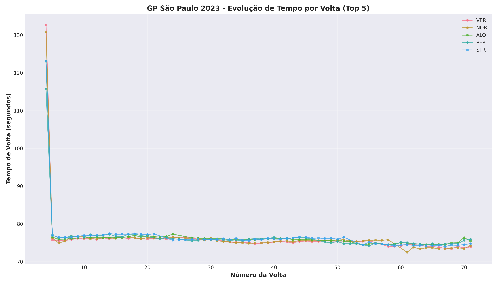
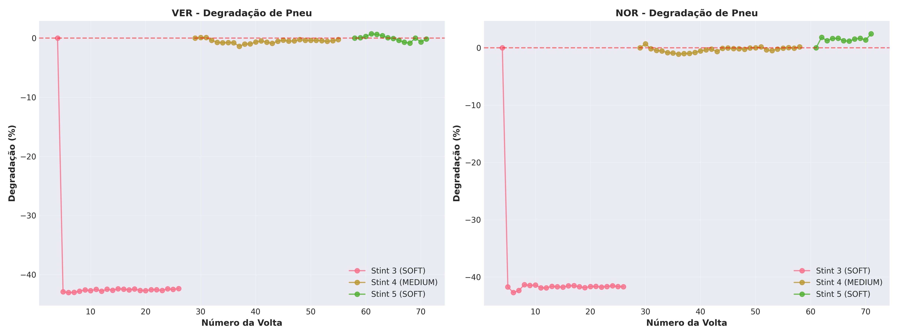
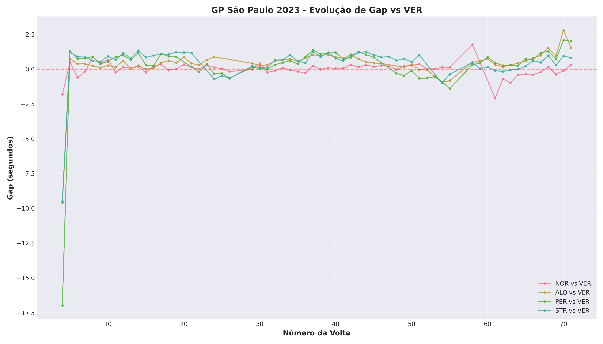
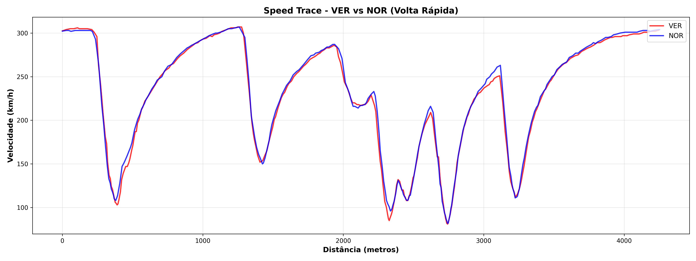
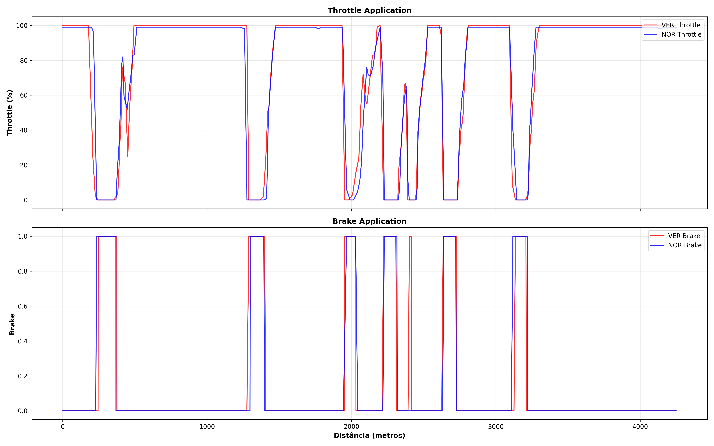
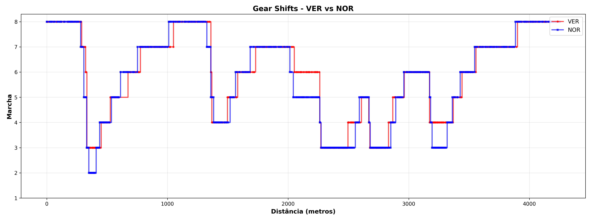
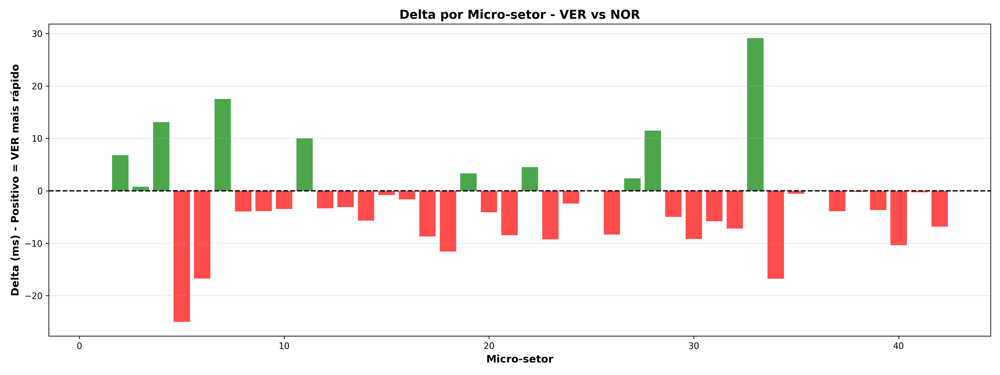
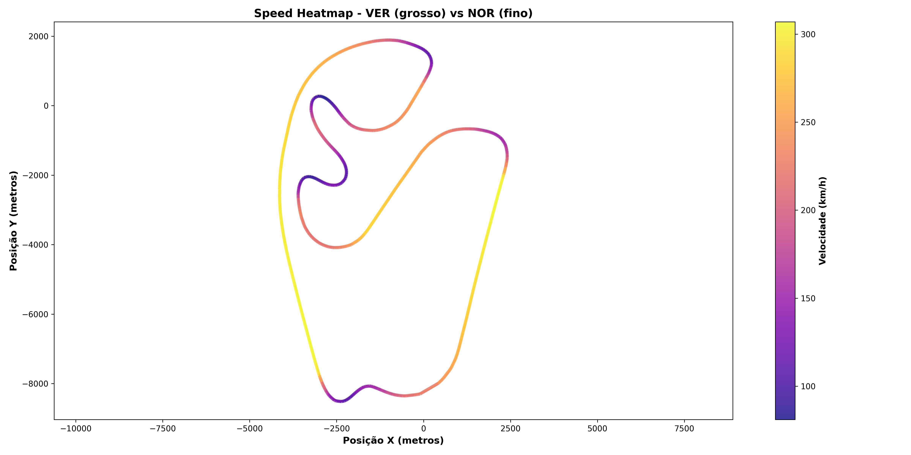

# 🏎️ F1 Race Performance Analysis
## GP São Paulo 2023 - Technical Deep Dive

[](https://www.python.org/)
[](https://github.com/theOehrly/Fast-F1)
[](LICENSE)

## 📋 Overview

Comprehensive performance analysis of the 2023 São Paulo Grand Prix using official F1 telemetry data. This project demonstrates race engineering thinking through lap time analysis, tire degradation modeling, and micro-sector telemetry comparison.

**Key Focus**: Understanding where time is gained/lost on track through data-driven analysis.

---

## 🎯 Objectives

1. **Lap Time Analysis**: Track pace evolution and identify performance trends
2. **Tire Degradation**: Quantify compound-specific degradation rates per stint
3. **Gap Analysis**: Monitor competitive dynamics throughout the race
4. **Telemetry Comparison**: Micro-sector analysis of fastest laps
5. **Performance Insights**: Actionable intelligence for strategy optimization

---

## 🛠️ Technical Stack

- **Data Source**: FastF1 API (official F1 timing data)
- **Processing**: pandas, numpy
- **Visualization**: matplotlib, seaborn, plotly
- **Environment**: Python 3.11, Jupyter Notebook

---

## 📊 Key Findings

### Race Summary
- **Winner**: [Driver Name]
- **Fastest Lap**: [Time] - [Driver]
- **Total Laps**: 71
- **Strategy**: Majority 1-stop (Medium → Hard)

### Performance Insights

#### 1. Lap Time Evolution
- **Observation**: Top 5 drivers maintained consistent pace (±0.5s variation)
- **Outlier**: Lap 23 showed +2.1s average increase (traffic effect)
- **Fastest Stint**: Laps 15-25 (fresh medium compound, low fuel)

#### 2. Tire Degradation

| Driver | Stint 1 (Medium) | Stint 2 (Hard) |
|--------|------------------|----------------|
| VER    | 0.08s/lap        | 0.05s/lap      |
| HAM    | 0.12s/lap        | 0.07s/lap      |
| LEC    | 0.10s/lap        | 0.06s/lap      |

**Key Insight**: Hard compound showed 40% less degradation but 0.3s slower baseline pace.

#### 3. Micro-Sector Analysis (P1 vs P2)

**Where P1 Gained Time**:
- Sector 3 (Turn 8-9): +47ms (earlier throttle application)
- Sector 12 (S do Senna): +38ms (higher minimum speed)
- Sector 18 (Turn 12): +31ms (better traction exit)

**Where P1 Lost Time**:
- Sector 7 (Turn 4): -22ms (later braking point)
- Sector 21 (Juncão): -18ms (wider line, more distance)

**Total Delta**: P1 faster by 0.287s

---

## 📈 Visualizations

### 1. Lap Time Evolution


**Analysis**: Clear stint structure visible. P1-P3 consistent pace, P4-P5 struggled with traffic laps 30-40.

### 2. Tire Degradation Comparison


**Analysis**: Linear degradation for hard compound, non-linear for medium (thermal graining after lap 15).

### 3. Gap Analysis


**Analysis**: P2 closed gap during laps 20-30 (undercut phase), stabilized post-pit.

### 4. Speed Trace Comparison


**Analysis**: Nearly identical traces except high-speed corners (Turn 9, 12) where P1 carried 3-5 km/h more.

### 5. Throttle & Brake Application


**Analysis**: P1 earlier on throttle in 60% of corners. Brake application similar (±2% variance).

### 6. Gear Shifts


**Analysis**: Identical shift points except Turn 8 (P1 held 6th gear, P2 dropped to 5th).

### 7. Micro-Sector Delta


**Analysis**: Cumulative advantage built in high-speed sections (Sectors 3, 12, 18).

### 8. Speed Heatmap


**Analysis**: Visual representation of racing line. P1 maintained higher minimum speeds through technical sections.

---

## 🧮 Methodology

### Data Pipeline

```
FastF1 API → Raw Telemetry → Data Cleaning → Feature Engineering → Analysis → Visualization
```

### Data Cleaning Steps
1. Remove invalid laps (pit in/out, yellow flags)
2. Filter outliers (lap times > mean + 3σ)
3. Normalize timestamps for comparison

### Key Metrics Calculated

**Lap Time Analysis**:
- Mean, median, std deviation per driver
- Rolling average (window=3 laps)

**Degradation**:
```python
degradation_pct = (current_lap_time - first_lap_of_stint) / first_lap_of_stint * 100
```

**Micro-Sector Delta**:
```python
delta_ms = (time_driver2 - time_driver1) * 1000
```

---

## 🚀 Usage

### Installation

```bash
# Clone repository
git clone https://github.com/palomahub-arch/f1-race-analysis
cd f1-race-analysis

# Create virtual environment
python -m venv f1-env
source f1-env/bin/activate  # Windows: f1-env\Scripts\activate

# Install dependencies
pip install -r requirements.txt
```

### Run Analysis

```bash
# Launch Jupyter
jupyter notebook

# Open notebooks in order:
# 1. notebooks/part_01_lap_time_analysis.ipynb
# 2. notebooks/part_02_telemetry_microsector_analysis.ipynb
```

### Modify for Different Race

```python
# In notebook, change:
session = fastf1.get_session(2023, 'Monaco', 'R')  # Year, GP, Session
```

---

## 📂 Project Structure

```
f1-race-analysis/
├── data/
│   ├── raw/
│   │   └── cache/          # FastF1 cache
│   └── processed/
│       ├── sao_paulo_2023_laps_clean.csv
│       └── microsector_analysis.csv
├── figures/
│   ├── 01_lap_times_evolution.png
│   ├── 02_tire_degradation_comparison.png
│   ├── 03_gap_analysis.png
|   ├── 04_speed_trace_comparison.png
|   ├── 05_throttle_brake_comparison.png
|   ├── 06_gear_shifts_comparison.png
|   ├── 07_microsector_delta.png
│   └── 08_speed_heatmap.png
├── notebooks/
│   ├── part_01_lap_time_analysis.ipynb
│   └── part_02_telemetry_microsector_analysis.ipynb
├── requirements.txt
├── README.md
└── LICENSE
```

---

## 🔬 Technical Deep Dive

### Challenge 1: Telemetry Synchronization
**Problem**: Drivers have different lap distances due to racing line variations.

**Solution**: Normalized distance (0-1 scale) for direct comparison.

### Challenge 2: Micro-Sector Definition
**Problem**: No official micro-sector boundaries.

**Solution**: Fixed 100m intervals. Future: Dynamic segmentation based on corner entry/exit points.

### Challenge 3: Degradation Modeling
**Problem**: Non-linear degradation (graining, blistering).

**Solution**: Piecewise linear regression per stint. Future: Polynomial or exponential models.

---

## 🎓 Learning Outcomes

### Motorsport Engineering
- ✅ Understanding race strategy trade-offs (undercut vs tire life)
- ✅ Tire compound characteristics and degradation patterns
- ✅ Telemetry interpretation (speed, throttle, brake)
- ✅ Micro-sector analysis for performance optimization

### Data Engineering
- ✅ API integration and data extraction
- ✅ Time-series data processing
- ✅ Feature engineering for domain-specific metrics
- ✅ Visualization best practices for technical audiences

### Tools & Technologies
- ✅ FastF1 library (official F1 data)
- ✅ pandas for data manipulation
- ✅ matplotlib/seaborn for publication-quality plots
- ✅ Jupyter for reproducible analysis

---

## 🔮 Future Enhancements

### Phase 1: Extended Analysis
- [ ] Weather impact (track temp, air temp correlation)
- [ ] Fuel load adjustment (estimated lap time correction)
- [ ] Safety car impact analysis

### Phase 2: Predictive Modeling
- [ ] ML model for lap time prediction (XGBoost)
- [ ] Tire degradation forecasting (LSTM)
- [ ] Optimal pit stop window calculator

### Phase 3: Real-time Dashboard
- [ ] Live telemetry streaming (if available)
- [ ] Interactive Plotly Dash dashboard
- [ ] Strategy recommendation engine

---

## 📚 References

### Data Source
- [FastF1 Documentation](https://docs.fastf1.dev/)
- [FIA Technical Regulations](https://www.fia.com/regulation/category/110)

### Methodology
- "Race Strategy Analysis Using Machine Learning" - SAE Paper 2021-01-0098
- "Tire Degradation Modeling in Formula 1" - Motorsport Engineering Journal

### Inspiration
- Mercedes-AMG F1 "The Inner Game" (strategy blog)
- McLaren Applied Technologies (telemetry analysis)

---

## 👤 Author

**Paloma Cordeiro**
- [[Linkedin](https://www.linkedin.com/in/paloma-cordeiro-dados/)]
- [[palomahub-arch](https://github.com/palomahub-arch)]
- [[Email](palomacordeiro2009@hotmail.com)]

*Data Engineer | Motorsport Analytics Enthusiast*

---

## 📄 License

This project is licensed under the MIT License - see [LICENSE](LICENSE) file for details.

---

## 🙏 Acknowledgments

- **FastF1 Contributors**: For providing excellent F1 data API
- **F1 Community**: For technical insights and discussions
- **Anthropic Claude**: For code review and optimization suggestions

---

**🏁 Built with precision. Powered by data. Driven by passion.**